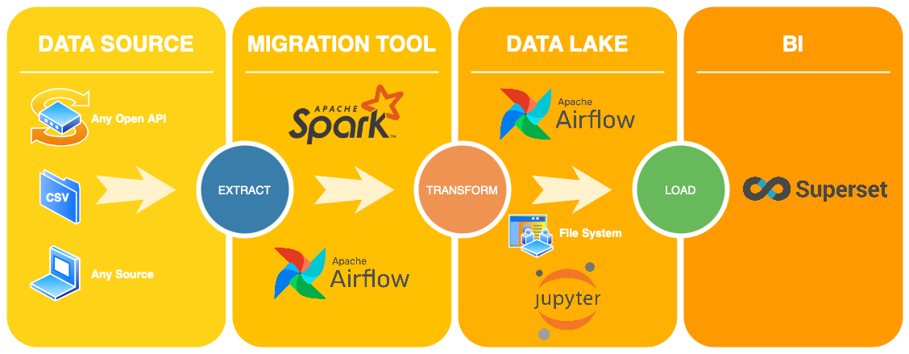
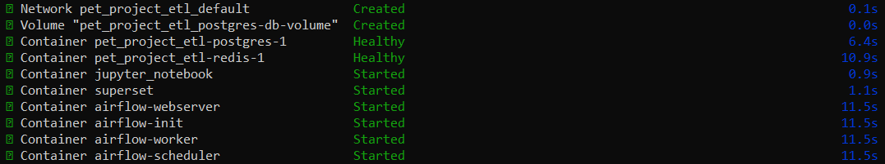
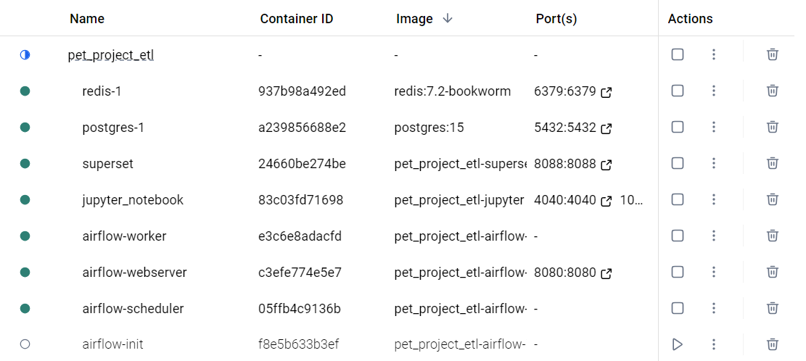
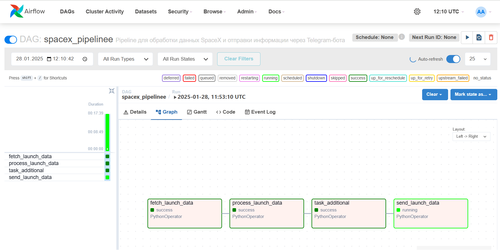
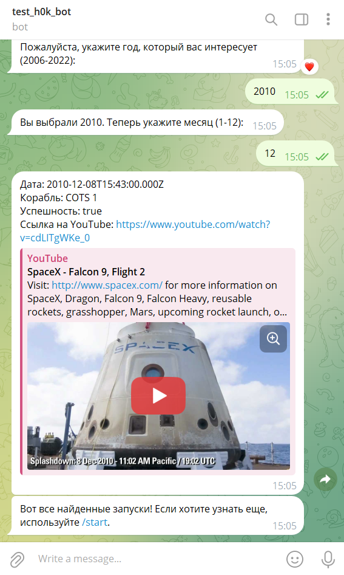
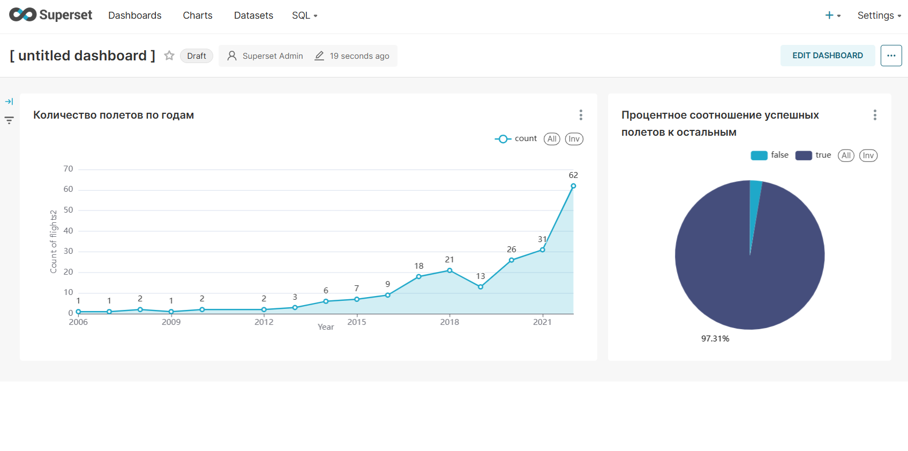

# **ETL Pipeline Project**



Этот проект представляет собой полноценный ETL-пайплайн, реализованный с использованием контейнеров Docker. Система включает в себя следующие компоненты:

- **Apache Airflow** – для оркестрации задач.
- **PostgreSQL** – база данных для хранения аналитических данных.
- **Jupyter Notebook** – для анализа данных и разработки.
- **Apache Spark** – для обработки и трансформации данных.
- **Apache Superset** – для визуализации данных.
- **pyTelegramBotAPI** – библиотека для взаимодействия с пользователем через Telegram-бота.

## **Цель проекта**
1. Предоставить пользователям возможность "в один клик" разворачивать локально популярные технологии для построения ETL процесса. Это решение хорошо подходит для **тестирования**, **обучения** и **экспериментов** с ETL-пайплайнами и связанными инструментами.

2. Создать ETL-процесс на основе данных API SpaceX, который включает:
 - Сбор данных с открытого API SpaceX.
 - Преобразование собранных данных с помощью Apache Spark.
 - Загрузку обработанных данных в базу данных PostgreSQL.
 - Реализацию Telegram-бота, который предоставляет доступ к этим данным.
 - Настройку аналитической платформы на базе Apache Superset для визуализации и анализа данных.

## **Инструкция по установке**

Проект предназначен для **личного использования**, тестирования и практики, а не для продакшн-использования. Пожалуйста, учитывайте, что в текущей реализации не учтены настройки безопасности для работы в сети.

Для корректной работы проекта ваш компьютер должен соответствовать следующим минимальным требованиям:

- Процессор:
Многоядерный процессор (минимум 4 ядра, рекомендуется 8 и более).
- Оперативная память (RAM):
Минимум 8 ГБ, рекомендуется 16 ГБ и выше.
- Место на диске:
Минимум 10 ГБ свободного места для образов Docker и хранения данных.
Программное обеспечение:
- Docker и Docker Compose установлены и настроены. Поддержка Python 3.8+.
- Поддержка виртуализации включена (необходима для работы Docker).

1. **Желательно ознакомиться с документацией Docker, посмотреть обучающие курсы.**
  
2. **Клонируйте репозиторий:**
   
   ```bash
   git clone https://example.com/your-repo.git

3. **Через консоль (командную строку) перейдите в папку с проектом (cd 'путь') и пропишите:**
   
   ```bash
   docker-compose up -d

Если запуск успешный, то переходим по ссылкам ниже:
## Services

| **Service**         | **URL/Host**                        | **User**   | **Password** |
|----------------------|-------------------------------------|------------|--------------|
| **Airflow**          | [http://localhost:8080](http://localhost:8080) | admin    | admin      |
| **PostgreSQL**       | `http://localhost:5432`            | airflow    | airflow      |
| **Jupyter Lab**      | [http://localhost:10000/lab](http://localhost:10000/lab) | -          | -            |
| **Apache Superset**  | [http://localhost:8088](http://localhost:8088) | admin      | admin        |

4. **Чтобы остановить работу проекта, в той же командной строке пишем:**
   
   ```bash
   docker-compose down

## **Механизм работы с данными API SpaceX в данном проекте**

Запустив веб-интерфейс Airflow, вы можете запустить DAG, который состоит из четырех этапов:

1. **Парсинг данных** – первый скрипт запрашивает данные о запусках SpaceX через API и сохраняет их в формате JSON.
2. **Обработка данных** – второй скрипт использует PySpark для работы с JSON-файлом, преобразует данные и сохраняет их в формате CSV.
3. **Загрузка в базу данных** – третий скрипт подключается к PostgreSQL, создаёт схему и таблицу, после чего загружает данные из CSV-файла.
4. **Запуск Telegram-бота** – четвертый скрипт запускает бота, разработанного с использованием библиотеки `pyTelegramBotAPI`, для предоставления информации пользователям.

### 📊 Визуализация данных в Apache Superset
В Superset реализован дашборд с аналитикой запусков SpaceX (данные берутся из бд):
- Диаграмма, показывающая соотношение успешных и неудачных полетов.
- График количества запусков по годам.

### 🚀 Как запустить DAG
Перед запуском укажите свой Telegram-токен в файле `src/consts`

### 🚀 Скриншоты





